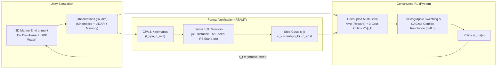

# Autonomous Marine Navigation with COLREG Compliance via Signal Temporal Logic & Constrained RL

[](https://www.python.org/downloads/release/python-31012/)
[](https://pytorch.org/)
[](https://github.com/Unity-Technologies/ml-agents)
[](https://github.com/nickovic/rtamt)
[](LICENSE)

An end-to-end framework integrating **Signal Temporal Logic (STL)** runtime verification with **Constrained Multi-Critic PPO** and **Conflict-Averse Gradient Descent (CAGrad)** for safe Autonomous Surface Vessel (ASV) navigation in a high-fidelity 3D marine environment (Unity HDRP).



---

## 1. Repository Structure

```text
COLREG_navigation/
├── Pdf/
│   ├── Temporal_Logic_Formalization_of_Marine_Traffic_Rules.pdf  # Krasowski & Althoff (2021) baseline
│   └── presentation.pdf                                          # Project slides & experimental presentation
├── PythonTrainer/
│   ├── algorithms/
│   │   ├── agent.py               # ConstrainedPPOAgent (Decoupled Multi-Critic + CAGrad)
│   │   ├── agent_CMORL.py         # Random Constraint Selection baseline
│   │   ├── networks.py            # Actor, Value, and CostValue MLP architectures
│   │   └── rewardshaping.py       # Reward Shaping baseline agent
│   ├── colreg_logic/
│   │   ├── colregR6.yaml          # Formal STL specifications (Rules R1, R2, R6)
│   │   └── rtamt_yml_parser.py    # Pre-compiled multi-monitor RTAMT interface
│   ├── utils/
│   │   ├── buffers.py             # Rollout buffer with Markovian STL flag updates
│   │   ├── cagrad.py              # Conflict-Averse Gradient Descent dual solver
│   │   ├── colreg_handler.py      # CPA extrapolation & safety margin calculations
│   │   └── plot_results.py        # TensorBoard / evaluation plotting utilities
│   ├── train.py                   # Main training loop (Multi-Critic + CAGrad)
│   ├── train_rewardshaping.py     # Training loop for Reward Shaping baseline
│   ├── train_parameters.py        # Grid search tuning script on Stage 0
│   ├── eval.py                    # Deterministic validation and generalization test suite
│   ├── demo.py                    # Real-time visual deployment with Unity Editor
│   └── environment.yml            # Conda / Mamba dependencies
├── UnityEnvironment/
│   └── COLREG_simulation/
│       └── Assets/Scripts/
│           ├── BoatAgent.cs       # ML-Agents agent: observations, curriculum, step rewards
│           └── HDRPBoatPhysics.cs # 6-point floater buoyancy, keel drag, thrusters
└── README.md
```

---

## 2. Environment Setup: Task, Spaces & Curriculum

### 2.1 Action Space
Continuous 2-dimensional control vector $a_{t} \in [-1.0, 1.0]^2$ controlling stern differential thrusters:

$$
a_t = [\text{throttle}, \, \text{steering}]^T
$$

* **Propulsion Mapping**: $T_{\text{left}} = \text{throttle} + \text{steering}$, $T_{\text{right}} = \text{throttle} - \text{steering}$ (clamped to $[-1, 1]$, scaled by $F_{\text{max}} = 25\,\text{N}$).
* **Asymmetric Reverse**: When $\text{throttle} < 0$, thrust is attenuated by $0.3\times$ to reflect maritime propeller inefficiency in reverse.

### 2.2 Observation Space (37 Dimensions)
| Slice | Dim | Description |
| :---: | :---: | :--- |
| `0:2` | 2 | Target relative direction (local 2D unit vector). |
| `2` | 1 | Normalized target distance ($d / d_{\text{max}}$, with $d_{\text{max}} = 43.0\,\text{m}$). |
| `3:5` | 2 | Local surge and sway velocities (normalized by $v_{\text{max}} = 2.5\,\text{m/s}$). |
| `5` | 1 | Local yaw rate (normalized by $\omega_{\text{max}} = 1.4\,\text{rad/s}$). |
| `6:13` | 7 | Intruder 1: relative position (2), distance (1), relative velocity (2), heading (2). |
| `13:20` | 7 | Intruder 2: relative position (2), distance (1), relative velocity (2), heading (2). |
| `20:34` | 14 | 7-ray LiDAR perception sensor $\times$ [normalized distance, hit flag]. |
| `34:37` | 3 | Real-time Markovian STL compliance flags in $[-0.5, 0.5]$ tracking $R_{1}, R_{2}, R_{6}$ over sliding window $\tau = 80$. |

### 2.3 Curriculum Learning Strategy
Task difficulty scales across three automated stages based on environment steps:
* **Stage 0 (Empty Arena, $0 \to 251\text{k}$ steps)**: No obstacles. Focuses on differential propulsion, water dynamics, and reaching the randomized target cylinder.
* **Stage 1 (Fixed Obstacles, $251\text{k} \to 501\text{k}$ steps)**: Spawns static spherical obstacles along circular tracks to establish spatial avoidance.
* **Stage 2 (Dynamic Traffic, $> 501\text{k}$ steps)**: Spawns two spline-driven intruder vessels with domain randomization (speed and trajectory scale vary per episode) to enforce active COLREG compliance.

---

## 3. COLREG Rules & STL Robustness Formulations

The steering and sailing rules formalize the International Regulations for Preventing Collisions at Sea (IMO, 1972; Krasowski & Althoff, 2021) using **Signal Temporal Logic (STL)** evaluated via `rtamt` in dense-time semantics over a sliding horizon ($H = 80$ steps, $4.0\,\text{s}$ at $20\,\text{Hz}$).

### 3.1 Kinematics & Closest Point of Approach (CPA)
From denormalized intruder relative position $\mathbf{p}_{\text{rel}}$ and velocity $\mathbf{v}_{\text{rel}}$, the analytical time to CPA ($t_{\text{cpa}}$) and horizon-bounded minimum distance ($d_{\text{min}}$ over $t_{h} = 1.0\,\text{s}$) are:

$$
t_{cpa} = -\frac{\mathbf{p}_{rel} \cdot \mathbf{v}_{rel}}{\|\mathbf{v}_{rel}\|^2} \quad (\text{for } \|\mathbf{v}_{rel}\|^2 > 10^{-6})
$$

$$
d_{min} = \begin{cases} 
\|\mathbf{p}_{rel}\| & \text{if } t_{cpa} < 0 \quad \text{(Diverging)} \\ 
\|\mathbf{p}_{rel} + \mathbf{v}_{rel} t_h\| & \text{if } t_{cpa} > t_h \quad \text{(Slow convergence)} \\ 
\|\mathbf{p}_{rel} + \mathbf{v}_{rel} t_{cpa}\| & \text{if } 0 \le t_{cpa} \le t_h \quad \text{(Imminent CPA)} 
\end{cases}
$$

### 3.2 Formal Specifications

#### Rule 1: Safe Distance (COLREG Rules 4 & 8(d))
Maintains a physical safety margin around other vessels ($d_{\text{safe}} = 2.0\,\text{m}$):

$$
\phi_{R1} = G_{[0, 80]} (s_{R1} \ge 0.0)
$$

$$
s_{R1} = \min(d_{min} - d_{safe}, \, 1.0\,\text{m})
$$

#### Rule 2: Safe Speed (COLREG Rules 4 & 6)
Restricts surge velocity in proximity to hazards ($v_{\text{safe\_limit}} = 2.1\,\text{m/s}$):

$$
\phi_{R2} = G_{[0, 80]} (v_{ego} \le v_{safe\_limit} \;\land\; v_{ego} \ge -1.0)
$$

$$
s_{R2} = v_{safe\_limit} - v_{ego}
$$

#### Rule 6: Stand-On Vessel (COLREG Rules 11, 15, 17)
When holding right-of-way (intruder in port sector $[5.0^\circ, 112.5^\circ]$ with collision risk within $t_{h} = 2.0\,\text{s}$), the vessel must maintain its course ($|a_{\text{steer}}| \le 0.1$) until the encounter is resolved:

$$
\phi_{R6} = G_{[0, 80]} \Big( (s_{keep} \le 0.0) \;\lor\; \big( (s_{no\_turn} \ge 0.0) \;\mathcal{U}\; (s_{keep} \le 0.0) \big) \Big)
$$

where:

$$
s_{keep} = \min(s_{risk}, \, s_{sector}), \qquad s_{risk} = -s_{R1}(t_h = 2.0\,\text{s})
$$

$$
s_{sector} = \frac{1}{k_\theta} \min(\theta - 5.0^\circ, \, 112.5^\circ - \theta), \quad \theta = \mathrm{atan2}(-p_x, p_z) \in [0^\circ, 180^\circ], \quad k_\theta = 10^\circ/\text{m}
$$

$$
s_{no\_turn} = 0.1 - |a_{steer}|
$$

### 3.3 Offline Episode-Aligned Monitoring & Cost Mapping
Online evaluation of future-oriented operators (such as the Until operator $\mathcal{U}$ in $R_{6}$) with an unknown future would force heuristic approximations. To compute **exact ground-truth robustness without future truncation**, rollout collection is strictly episode-aligned (`while len(buffer) < 2048 or not end_episode`). At episode boundaries, RTAMT evaluates the complete trajectory trace offline with full future knowledge. Continuous robustness values $\rho_{k}$ are then mapped to bounded step costs ($c_{k} > 0 \iff \rho_{k} < 0$):

$$
c_k = \tanh(-\rho_k) \cdot \alpha_{cost}, \quad \alpha_{cost} = 0.1
$$

---

## 4. Multi-Critic Architecture & CAGrad

### 4.1 Decoupled Multi-Critic Structure
Rather than collapsing task rewards and safety penalties into a single scalar value function (as in standard reward shaping), the agent decouples objectives into four separate networks (2-layer MLPs, 128 units):
1. **$V^\phi(\mathbf{s})$ (Task Value Critic)**: Estimates expected target-reaching returns.
2. **$V^{\psi_1}_{R1}(\mathbf{s})$ (Distance Cost Critic)**: Estimates discounted cumulative penalties for Rule $R_{1}$.
3. **$V^{\psi_2}_{R2}(\mathbf{s})$ (Speed Cost Critic)**: Estimates discounted cumulative penalties for Rule $R_{2}$.
4. **$V^{\psi_3}_{R6}(\mathbf{s})$ (Stand-on Cost Critic)**: Estimates discounted cumulative penalties for Rule $R_{6}$.

This decoupling isolates per-rule advantage signals $\hat{A}^{cost}_{Rk} = \text{GAE}(c_{Rk}, V^{\psi_k}_{Rk})$, preventing high mission rewards from obscuring critical safety infractions.

### 4.2 Shared Scale Normalization
Standard independent advantage normalization ($\sigma_{k} = 1$) distorts multi-objective balance by artificially equating minor infractions with critical collision risks. To maintain true physical ratios across active violations $\mathcal{V} = \{k \mid \rho_{k} < 0\}$:

$$
\bar{A}_{Rk} = \frac{A_{Rk} - \mu_{Rk}}{\max_{j \in \mathcal{V}}(\sigma_{Rj}) + \epsilon}, \quad \epsilon = 10^{-8}
$$

### 4.3 Mode Switching & CAGrad Conflict Resolution
The policy loss $\mathcal{L}(\theta)$ dynamically switches based on safety compliance:
* **Nominal Mode ($\forall k, \rho_{k} \ge 0$)**: Maximizes task progress:
  $\mathcal{L}(\theta) = \mathcal{L}^{CLIP}(\theta, \bar{A}^{reward}) - c_{\text{ent}} \mathcal{H}(\pi_\theta)$.
* **Single Violation ($\exists! k, \rho_{k} < 0$)**: Discards task return to prioritize immediate recovery:
  $\mathcal{L}(\theta) = \mathcal{L}^{CLIP}(\theta, -\bar{A}^{cost}_{Rk}) - c_{\text{ent}} \mathcal{H}(\pi_\theta)$.
* **Multiple Violations ($|\mathcal{V}| > 1$)**: When rules issue conflicting gradients (e.g., accelerating to clear distance vs. braking for safe speed), **CAGrad** ($c=0.5$) solves the dual optimization problem to find the optimal consensus descent direction $g_{m}$:

$$
g_m = \arg\max_g \min_{k \in \mathcal{V}} \langle g, g_{Rk} \rangle \quad \text{subject to} \quad \|g - g_{avg}\| \le c \|g_{avg}\|
$$

where $g_{Rk} = \nabla_\theta \mathcal{L}^{CLIP}(\theta, -\bar{A}^{cost}_{Rk})$ and $g_{\text{avg}} = \frac{1}{|\mathcal{V}|} \sum_{k \in \mathcal{V}} g_{Rk}$.

---

## 5. Experimental Benchmarks & Results

Evaluated across 5 random seeds (`[1, 3, 7, 34, 42]`) with $2.05\text{M}$ total environment steps (safety activated at $1.02\text{M}$).

### 5.1 Validation Benchmark (Seed 59, 10 Episodes)
| Method | Checkpoint | Mean Return | Safe R1 (%) | Safe R2 (%) | Safe R6 (%) | Totally Safe (%) |
| :--- | :--- | :---: | :---: | :---: | :---: | :---: |
| **Ours (Multi-Critic + CAGrad)** | Pre-Safety ($1.02\text{M}$) | $5.32 \pm 7.90$ | 50% | 100% | 10% | 10% |
| | **BEST** ($1.29\text{M}$) | **$6.95 \pm 5.95$** | **70%** | **100%** | **30%** | **30%** |
| | LAST ($2.05\text{M}$) | $-4.91 \pm 10.08$ | 70% | 100% | 20% | 20% |
| **Reward Shaping (RS)** | Pre-Safety ($1.02\text{M}$) | $5.20 \pm 7.76$ | 30% | 100% | 0% | 0% |
| | **BEST** ($1.31\text{M}$) | $7.34 \pm 6.00$ | 60% | 100% | 30% | **30%** |
| | LAST ($2.05\text{M}$) | $4.44 \pm 8.78$ | 50% | 60% | 30% | 20% |
| **Random CMORL** | Pre-Safety ($1.02\text{M}$) | $3.54 \pm 8.94$ | 50% | 80% | 10% | 10% |
| | **BEST** ($1.04\text{M}$) | $7.35 \pm 5.98$ | 50% | 80% | 20% | 10% |
| | LAST ($2.05\text{M}$) | $-9.34 \pm 3.88$ | 20% | 100% | 10% | 10% |

### 5.2 Generalization Test Benchmark (Seed 2005, Unseen Episodes)
| Method | Checkpoint | Mean Return | Safe R1 (%) | Safe R2 (%) | Safe R6 (%) | Totally Safe (%) |
| :--- | :--- | :---: | :---: | :---: | :---: | :---: |
| **Ours (Multi-Critic + CAGrad)** | Pre-Safety ($1.02\text{M}$) | $7.27 \pm 6.10$ | 20% | 90% | 20% | 10% |
| | **BEST** ($1.29\text{M}$) | **$9.01 \pm 0.74$** | **30%** | **100%** | **30%** | **30%** |
| | LAST ($2.05\text{M}$) | $-3.85 \pm 10.53$ | 50% | 100% | 30% | 30% |
| **Reward Shaping (RS)** | Pre-Safety ($1.02\text{M}$) | $1.25 \pm 9.59$ | 20% | 90% | 20% | 10% |
| | **BEST** ($1.31\text{M}$) | $9.27 \pm 0.43$ | 30% | 90% | 20% | 10% |
| | LAST ($2.05\text{M}$) | $7.13 \pm 5.95$ | 30% | 60% | 30% | 10% |
| **Random CMORL** | Pre-Safety ($1.02\text{M}$) | $9.09 \pm 0.91$ | 30% | 80% | 30% | 20% |
| | **BEST** ($1.04\text{M}$) | $9.30 \pm 0.34$ | 30% | 80% | 30% | 20% |
| | LAST ($2.05\text{M}$) | $-11.48 \pm 3.02$ | 20% | 100% | 20% | 20% |

### 5.3 Key Takeaways
1. **Safety vs. Progress Trade-Off**: Our **BEST** checkpoint achieves **30% totally safe episodes** (all three rules satisfied concurrently) while sustaining high navigation return ($9.01 \pm 0.74$).
2. **Catastrophic Forgetting**: In constrained RL with strict preemption, optimizing purely for safety during multiple constraint violations causes task returns to degrade over prolonged training.
3. **Tri-Criteria Checkpointing is Essential**: The final policy ($2.05\text{M}$ steps) is rarely the safest or best-performing policy. Tracking tri-criteria checkpoints (*Best Nominal*, *Best Safe Mean*, *Best Safe Percentage $\ge 80\%$*) is required for dependable deployment.

---

## 6. Quickstart Guide

### 6.1 Installation
Pull Git LFS assets and create the virtual environment using Mamba or Conda:
```bash
git lfs install
git lfs pull

# Create and activate environment
conda env create -f PythonTrainer/environment.yml
conda activate colreg_xai
```

### 6.2 Training
Ensure `unity_env_path` in the training script points to your Unity build or is set to `None` to use the Unity Editor:
```bash
cd PythonTrainer

# Train proposed method (Decoupled Multi-Critic + CAGrad)
python train.py

# Train baseline (Reward Shaping)
python train_rewardshaping.py

# Run hyperparameter grid search on Stage 0
python train_parameters.py
```

### 6.3 Evaluation & Visual Demo
```bash
cd PythonTrainer

# Run validation and test benchmarks
python eval.py

# Run real-time visual demo with Unity Editor (Press Play in Unity)
python demo.py
```

---

## 7. References
1. **H. Krasowski and M. Althoff**, *"Temporal Logic Formalization of Marine Traffic Rules"*, IEEE Intelligent Vehicles Symposium (IV), 2021.
2. **B. Liu et al.**, *"Conflict-Averse Gradient Descent for Multi-task Learning"*, NeurIPS, 2021.
3. **International Maritime Organization (IMO)**, *"Convention on the International Regulations for Preventing Collisions at Sea (COLREGs)"*, 1972.